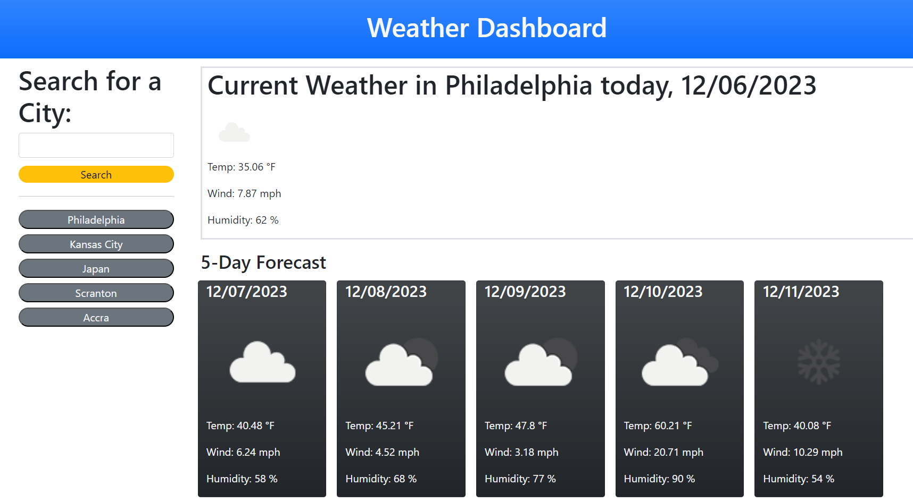

# Weather Dashboard

## Description

Rain or shine, everyone must prepare to venture to the great outdoors. A handy application for grabbing the weather in your city sounds essential for whenever that arises, and I can confidently say this is the first application I've made that while in development I used it - I instinctively used it to prepare my attire for my walk to work, as it was faster than checking my phone at the time. Utilizing local storage to persist the search meant I only needed one click to know exactly how my excursion would fare. This application also reinforced a number of crucial lessons. Scoping variables is incredibly important, even loop indices, as nested loops wreaked havoc on me. Data is not in standard formats across applications, as before I realized dayJS wanted unix in milliseconds, it appeared that I was retrieving weather data from the 1970s. Local Storage is also difficult to wrangle when you have to consistently pass the data back and forth, and I'm sure there was a more elegant way to handle that challenge, but that's for a future project. This was a great introduction to the power of third-party APIs.

## Installation

[Access the website by clicking here!](https://redknight88.github.io/weather-dashboard/index.html)

## Usage

The website is fairly lightweight and only has a few interactive elements. On the left is an input field to type the name of a city. When finished, clicking on the "Search" button loads the weather data from the OpenWeatherMap API. The page will populate with the temperature, wind speed, and humidity of the current weather and each of the next five days. The page will also populate the city name below the Search button, and will store that weather data locally, so refreshing will not lose your previous searches. Clicking on those buttons will repopulate the fields with that data, even if you search for another city.

